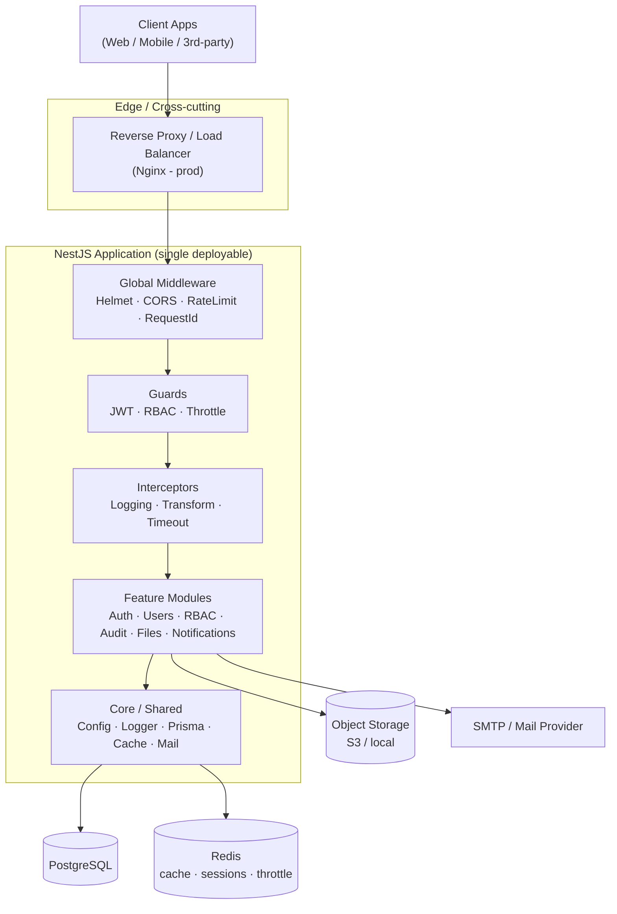
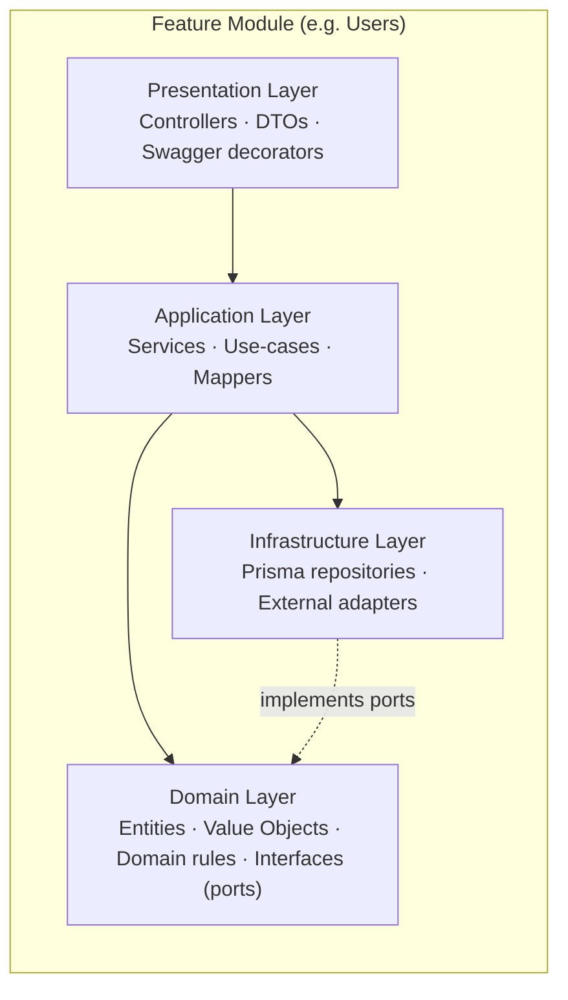
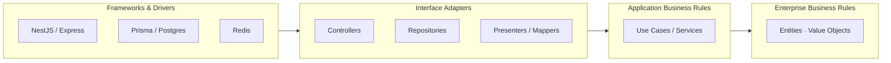
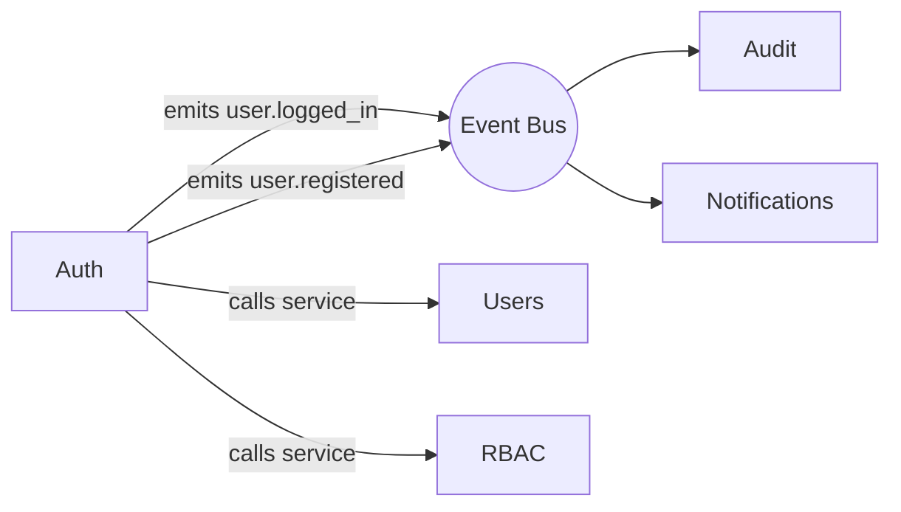
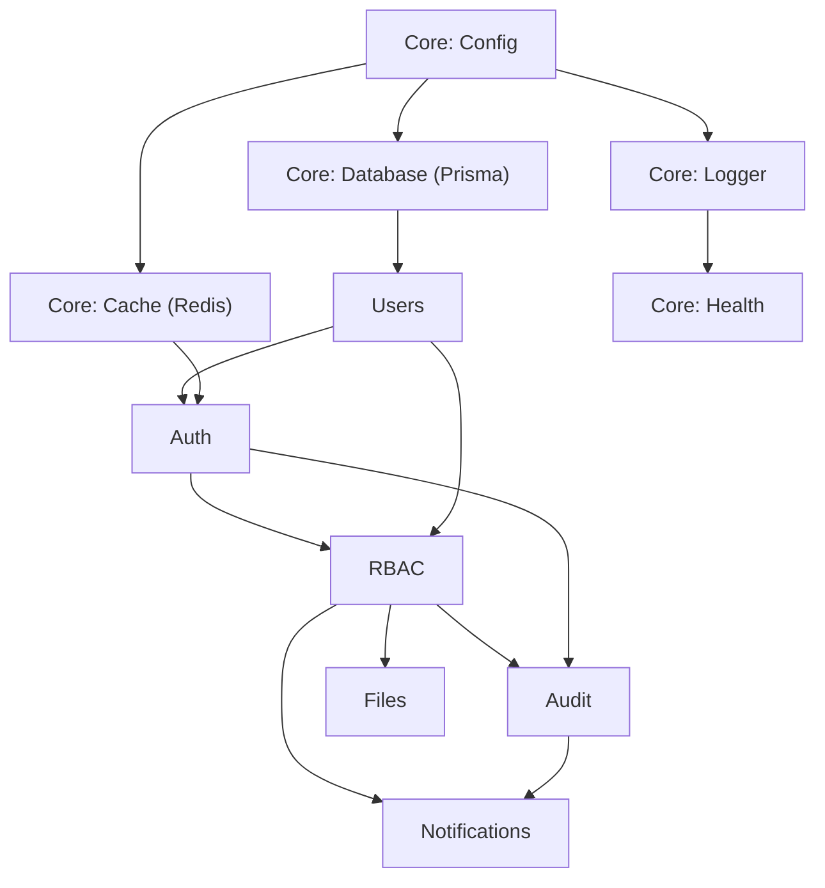
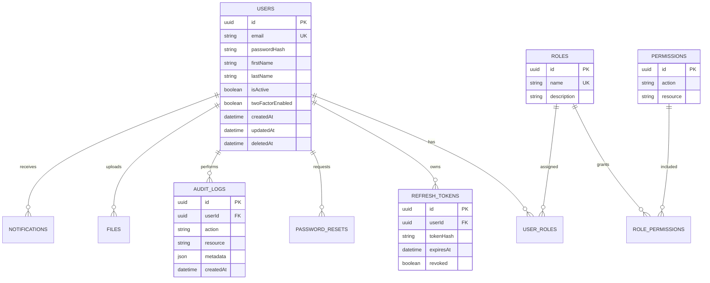
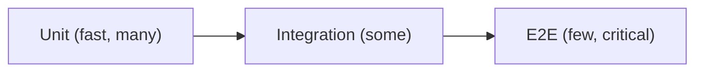
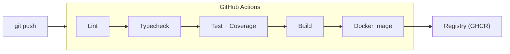
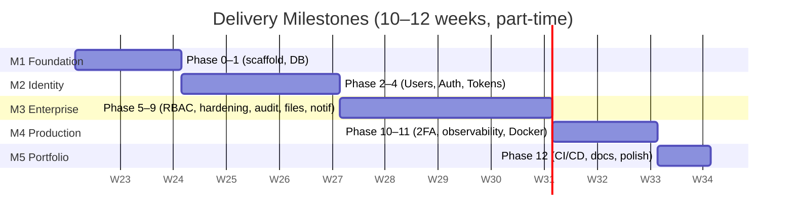

# Enterprise NestJS Backend Starter Kit — Architecture & Implementation Roadmap

> **Document type:** Software Architecture Document (SAD) + Delivery Roadmap
> **Owner:** Bhaskar Reddy Gurram
> **Status:** Planning baseline (pre-code)
> **Target timeline:** 10–12 weeks, part-time (~12–15 h/week)
> **Stack:** Node.js · TypeScript · NestJS · PostgreSQL · Prisma · Redis · JWT · Docker · Swagger · Jest

---

## 0. Document Purpose

This document defines **how** the platform is built before **any** code is written. It is the contract between intent and implementation. It exists to:

- Prevent technical debt by deciding boundaries, naming, and standards up front.
- Sequence work so each phase compiles, runs, and is testable on its own.
- Be portfolio-grade: a reviewer (or a German hiring manager) can read this and understand your engineering maturity without running the code.

The goal is a **Generic Backend API Platform** — an opinionated, reusable foundation that any vertical (CRM, ERP, HR, Inventory, SaaS, E-commerce, Booking, Property Management) can be built on top of by adding domain modules, **not** by rewriting infrastructure.

---

## 1. High-Level Architecture

### 1.1 Architectural Style

We combine four complementary ideas. They are not competing — each governs a different concern:

| Concern | Approach | What it gives us |
|---|---|---|
| Process/deployment shape | **Modular Monolith** (microservice-ready) | One deployable, clean internal seams. Split later only if scale demands it. |
| Code organization | **Layered Architecture** | Predictable file placement, separation of HTTP / business / data. |
| Dependency direction | **Clean Architecture** | Business logic never depends on frameworks or DB. Testable core. |
| Business modeling | **Domain-Driven Design (lite)** | Modules == bounded contexts. Ubiquitous language. Aggregates. |

> **Decision:** Start as a **modular monolith**, not microservices. Microservices add network, deployment, and observability cost that a starter kit and a solo developer should not pay. Boundaries are kept clean enough that any module *could* be extracted into a service later. This is the mature, defensible choice and reads well in interviews.

### 1.2 System Architecture (Container View)



### 1.3 Layered Architecture (inside a module)

Every feature module follows the same four layers. Dependencies point **downward only**.



**Rule of thumb (Clean Architecture):** The Domain layer imports *nothing* from NestJS, Prisma, or HTTP. Outer layers depend on inner layers; inner layers depend only on abstractions (ports/interfaces) that outer layers implement.

### 1.4 Dependency Rule (Clean Architecture)



> Dependencies always point **inward**. Nothing in `Domain` knows that Prisma or HTTP exists.

### 1.5 DDD Boundaries (Bounded Contexts)

For the generic platform, each context = one NestJS module with its own service, schema ownership, and ubiquitous language.

| Bounded Context | Responsibility | Owns tables |
|---|---|---|
| **Identity & Access** | Authentication, tokens, sessions | `users`, `refresh_tokens`, `password_resets` |
| **Authorization (RBAC)** | Roles, permissions, assignments | `roles`, `permissions`, `role_permissions`, `user_roles` |
| **Audit & Compliance** | Immutable activity trail | `audit_logs` |
| **File Management** | Upload, storage metadata | `files` |
| **Notifications** | Email/in-app messaging | `notifications`, `notification_templates` |
| **Platform/Core** | Config, health, observability | (no domain tables) |

### 1.6 Module Communication

- **Synchronous, in-process:** Modules talk via **injected services** through their **public interface only** (the module's exported provider). No reaching into another module's repository.
- **Decoupled events:** Cross-cutting reactions (e.g. "user logged in → write audit log", "user registered → send welcome email") use the **NestJS EventEmitter** (`@nestjs/event-emitter`). This keeps Auth from depending on Audit/Notifications directly.
- **Future-proofing:** Because communication is already event-based for side effects, swapping `EventEmitter` for a real message broker (RabbitMQ/Kafka) during a microservice split is a localized change.



### 1.7 Database Design Principles

1. **One source of truth** — Prisma schema is the single definition; migrations are generated, reviewed, and committed.
2. **UUID primary keys** (`uuid` / `cuid`) — avoids enumeration attacks, eases multi-tenant/merge scenarios.
3. **Soft deletes where audit matters** (`deletedAt` nullable) — never lose history on core entities.
4. **Timestamps everywhere** — `createdAt`, `updatedAt` on every table.
5. **Normalize to 3NF**, denormalize only with a measured reason.
6. **Explicit join tables** for many-to-many (`user_roles`, `role_permissions`) — no implicit magic.
7. **Indexes on foreign keys and query hot-paths** (email, tokens).
8. **No business logic in the DB** (no triggers for domain rules) — keep logic in the application layer for testability. Constraints (unique, FK, not-null) *are* used for integrity.
9. **Append-only audit log** — audit rows are never updated or deleted.

---

## 2. Project Folder Structure

```
nestjs-enterprise-starter/
├── docker/                       # Dockerfiles, compose overrides, nginx conf
├── prisma/
│   ├── schema.prisma             # Single source of DB truth
│   ├── migrations/               # Versioned, committed migrations
│   └── seed.ts                   # Idempotent seed (admin user, base roles)
├── test/                         # E2E tests (supertest) + test utils
│   └── e2e/
├── src/
│   ├── main.ts                   # Bootstrap: app, Swagger, global pipes
│   ├── app.module.ts             # Root module wiring
│   │
│   ├── core/                     # App-wide singletons, no business logic
│   │   ├── config/               # Typed config + env validation (Joi/zod)
│   │   ├── database/             # PrismaService + PrismaModule
│   │   ├── cache/                # Redis module + cache service
│   │   ├── logger/               # Pino/winston logger module
│   │   ├── health/               # /health, /readiness (Terminus)
│   │   └── mail/                 # Mail transport abstraction
│   │
│   ├── common/                   # Reusable, stateless building blocks
│   │   ├── decorators/           # @CurrentUser, @Roles, @Public, @ApiPaginated
│   │   ├── guards/               # JwtAuthGuard, RolesGuard, ThrottleGuard
│   │   ├── interceptors/         # Transform, Logging, Timeout
│   │   ├── filters/              # GlobalExceptionFilter
│   │   ├── pipes/                # ValidationPipe config, ParseUuidPipe
│   │   ├── dto/                  # PaginationDto, base response DTOs
│   │   ├── interfaces/           # Shared contracts (ApiResponse, Paginated)
│   │   └── utils/                # Pure helpers (hashing wrappers, etc.)
│   │
│   ├── modules/                  # Bounded contexts (the platform features)
│   │   ├── auth/
│   │   │   ├── auth.module.ts
│   │   │   ├── auth.controller.ts
│   │   │   ├── auth.service.ts
│   │   │   ├── strategies/        # jwt.strategy, refresh.strategy
│   │   │   ├── dto/               # LoginDto, RegisterDto, TokenDto
│   │   │   └── auth.service.spec.ts
│   │   ├── users/
│   │   │   ├── users.module.ts
│   │   │   ├── users.controller.ts
│   │   │   ├── users.service.ts
│   │   │   ├── users.repository.ts   # Prisma adapter (implements port)
│   │   │   ├── domain/               # User entity, value objects
│   │   │   ├── dto/
│   │   │   └── users.service.spec.ts
│   │   ├── rbac/                  # roles + permissions
│   │   ├── audit/
│   │   ├── files/
│   │   └── notifications/
│   │
│   └── shared/                   # Cross-module domain primitives
│       ├── enums/
│       ├── constants/
│       └── events/               # Event name constants + payload types
│
├── .env.example                  # Documented sample env
├── .eslintrc / .prettierrc
├── jest.config.ts
├── docker-compose.yml
├── Dockerfile
├── README.md                     # Setup, architecture summary, decisions
└── CHANGELOG.md
```

### Why each top-level folder exists

| Folder | Purpose | Scalability rationale |
|---|---|---|
| `core/` | App-wide infrastructure singletons (DB, cache, config, logger). Imported once. | New infra (e.g. message queue) plugs in here without touching features. |
| `common/` | Stateless, reusable HTTP/cross-cutting building blocks. | Guards/interceptors written once, reused by every future module. |
| `modules/` | Bounded contexts. Each is self-contained and independently testable. | Adding a vertical (e.g. `inventory/`) = add a folder. Nothing else changes. |
| `shared/` | Domain primitives shared across contexts (enums, event contracts). | Prevents circular deps between modules. |
| `prisma/` | DB schema, migrations, seed — the data contract. | Migrations are versioned history; safe team & prod evolution. |
| `test/` | E2E and integration harness. | Mirrors `src` so coverage scales with features. |
| `docker/` | Container & local infra definitions. | Same image local → CI → prod. |

> **Key principle:** `modules/` should never import from another module's internals (`users/users.repository.ts`). It imports the **module**, gets the **exported service**. This single rule is what keeps a monolith from rotting.

---

## 3. Development Roadmap (Phases)

| Phase | Name | Goal | Complexity | Depends on | Key Deliverables |
|---|---|---|---|---|---|
| **0** | Project Foundation | Bootable, linted, typed skeleton | ⭐ Low | — | Repo, NestJS app, ESLint/Prettier, config module, env validation, Swagger stub, `/health` |
| **1** | Database Infrastructure | Prisma + Postgres + Redis wired | ⭐⭐ Low-Med | P0 | PrismaModule, RedisModule, base schema (`users`), first migration, seed script |
| **2** | User Module (CRUD) | Reference module proving the layered pattern | ⭐⭐ Medium | P1 | Users CRUD, DTOs, validation, pagination, repository pattern, unit tests |
| **3** | Authentication | Secure login/registration with JWT | ⭐⭐⭐ Med-High | P2 | Register/login, password hashing (argon2), JWT access tokens, `JwtAuthGuard`, `@CurrentUser` |
| **4** | Refresh Tokens & Sessions | Long-lived sessions, rotation, logout | ⭐⭐⭐ High | P3 | Refresh token rotation, Redis-backed sessions, logout/logout-all, reuse detection |
| **5** | Authorization (RBAC) | Role & permission enforcement | ⭐⭐⭐ High | P4 | Roles, permissions, `@Roles`/`@Permissions`, `RolesGuard`, seed admin |
| **6** | Cross-cutting Hardening | Consistent API contract & safety | ⭐⭐ Medium | P3 | Global exception filter, response transform interceptor, request-id, helmet, CORS, rate limiting |
| **7** | Audit Logging | Immutable activity trail via events | ⭐⭐ Medium | P5 | EventEmitter wiring, `audit_logs`, audit interceptor/listener |
| **8** | File Management | Upload & metadata | ⭐⭐ Medium | P5 | Multer/stream upload, storage adapter (local/S3), `files` table, validation |
| **9** | Notifications | Email + in-app, templated | ⭐⭐ Medium | P5, P7 | Mail module, templates, in-app notifications, queue-ready |
| **10** | Security Depth (2FA, policies) | Enterprise auth maturity | ⭐⭐⭐ High | P5 | TOTP 2FA, password policy, account lockout, password reset flow |
| **11** | Observability & DevOps | Production operability | ⭐⭐ Medium | P6 | Structured logging, metrics, readiness/liveness, Dockerized infra |
| **12** | CI/CD & Release | Automated quality gate & ship | ⭐⭐ Medium | All | GitHub Actions (lint→test→build→image), coverage gate, docs, CHANGELOG |

**Complexity legend:** ⭐ trivial · ⭐⭐ a focused weekend · ⭐⭐⭐ the hard, interview-worthy parts.

---

## 4. Feature Prioritization Matrix (MoSCoW)

| Feature | Priority | Rationale |
|---|---|---|
| Project scaffolding, config, env validation | **Must** | Nothing runs without it |
| Prisma + Postgres + migrations | **Must** | Data backbone |
| Users CRUD + validation + pagination | **Must** | Reference pattern for every module |
| JWT authentication | **Must** | Table stakes for any backend |
| Refresh token rotation | **Must** | Real auth, not a toy |
| RBAC (roles + permissions) | **Must** | The headline enterprise feature |
| Global error/response contract | **Must** | Defines API professionalism |
| Helmet, CORS, rate limiting | **Must** | Baseline security; recruiters check |
| Health checks | **Must** | Required for container orchestration |
| Dockerfile + docker-compose | **Must** | "Clone and run" portfolio requirement |
| Swagger/OpenAPI docs | **Must** | First thing a reviewer opens |
| Unit + E2E tests (core paths) | **Must** | German market expects tested code |
| Audit logging | **Should** | Strong differentiator, shows event-driven design |
| Redis caching layer | **Should** | Demonstrates performance awareness |
| Structured logging (Pino) | **Should** | Production maturity signal |
| CI/CD pipeline | **Should** | Shows DevOps fluency |
| Password reset flow | **Should** | Expected in real products |
| File upload module | **Could** | Useful, not core to "platform" |
| Email notifications | **Could** | Nice, can be stubbed |
| 2FA (TOTP) | **Could** | Impressive but advanced; after core is solid |
| In-app notifications | **Could** | Vertical-specific |
| Metrics/Prometheus | **Could** | Bonus observability |
| Multi-tenancy | **Won't (v1)** | Big design decision; document as future work |
| GraphQL layer | **Won't (v1)** | REST-first; note as extensibility point |
| Message broker (Kafka/Rabbit) | **Won't (v1)** | Only on microservice split |

---

## 5. Module Dependency Map



### Build order (must precede →)

```
Config → Database → Cache → Logger      (Core infrastructure first)
   → Users                              (reference domain module)
      → Auth                            (needs Users to authenticate)
         → Refresh/Sessions             (extends Auth + Cache)
            → RBAC                       (needs authenticated identity)
               → Audit                   (observes Auth + RBAC events)
               → Files                   (protected by RBAC)
               → Notifications           (triggered by Audit/Auth events)
```

**Critical path:** `Config → Database → Users → Auth → RBAC`. Everything else hangs off RBAC. Build the critical path depth-first; bolt on Audit/Files/Notifications breadth-first afterward.

---

## 6. Database Design Roadmap

### Build order

```
1. Users            (identity anchor)
2. Roles            (RBAC)
3. Permissions      (RBAC)
4. RolePermissions  (join: Roles ⇄ Permissions)
5. UserRoles        (join: Users ⇄ Roles)
6. RefreshTokens    (sessions)
7. PasswordResets   (recovery)
8. AuditLogs        (activity trail)
9. Files            (uploads)
10. Notifications   (messaging)
```

### Entity relationships



**Relationship notes**
- `Users ⇄ Roles` is many-to-many via `UserRoles` (a user can be Admin + Manager).
- `Roles ⇄ Permissions` is many-to-many via `RolePermissions` (permission-based RBAC, more flexible than role-only).
- `Permissions` modeled as `action` + `resource` (e.g. `read:user`, `delete:file`) — fine-grained and self-documenting.
- `RefreshTokens` store a **hash**, never the raw token; rotation revokes the old row.
- `AuditLogs` are append-only; `userId` is nullable for system events.

---

## 7. API Design Standards

### 7.1 URL Naming
- **Nouns, plural, kebab-case, versioned:** `/api/v1/users`, `/api/v1/refresh-tokens`.
- **Hierarchy for ownership:** `/api/v1/users/{id}/roles`.
- **Verbs only for non-CRUD actions:** `POST /api/v1/auth/login`, `POST /api/v1/auth/refresh`.
- No verbs in resource URLs (`/getUsers` ❌).

### 7.2 Response Envelope (success)
```json
{
  "success": true,
  "statusCode": 200,
  "message": "User retrieved successfully",
  "data": { "id": "…", "email": "a@b.com" },
  "meta": null,
  "timestamp": "2026-06-08T10:00:00.000Z",
  "path": "/api/v1/users/123"
}
```

### 7.3 Error Structure
```json
{
  "success": false,
  "statusCode": 422,
  "message": "Validation failed",
  "errorCode": "VALIDATION_ERROR",
  "errors": [
    { "field": "email", "constraint": "must be a valid email" }
  ],
  "timestamp": "2026-06-08T10:00:00.000Z",
  "path": "/api/v1/auth/register"
}
```
- One **global exception filter** produces this shape for every thrown error.
- Stable, machine-readable `errorCode` enum (`VALIDATION_ERROR`, `UNAUTHORIZED`, `FORBIDDEN`, `NOT_FOUND`, `CONFLICT`, `RATE_LIMITED`, `INTERNAL`).

### 7.4 Pagination (cursor-friendly, offset default)
Request: `GET /api/v1/users?page=2&limit=20`
```json
{
  "data": [ /* … */ ],
  "meta": {
    "page": 2, "limit": 20, "totalItems": 137,
    "totalPages": 7, "hasNext": true, "hasPrev": true
  }
}
```

### 7.5 Filtering
`GET /api/v1/users?filter[isActive]=true&filter[role]=admin`
- Whitelist filterable fields per resource (never trust arbitrary keys → no Prisma injection).

### 7.6 Sorting
`GET /api/v1/users?sort=-createdAt,email`
- `-` prefix = descending. Multiple comma-separated. Whitelist sortable fields.

### 7.7 Search
`GET /api/v1/users?search=bhaskar`
- Single full-text-ish param; backend decides which columns (`firstName`, `lastName`, `email`) with `ILIKE`/`tsvector`.

> All four (filter/sort/search/paginate) share **one reusable `QueryParamsDto`** + a query-builder helper, so every future module gets them for free.

---

## 8. Security Roadmap (ordered, with rationale)

| Order | Control | Why this point in the sequence |
|---|---|---|
| 1 | **Input validation** (`class-validator` + global `ValidationPipe`, whitelist + forbidNonWhitelisted) | First line of defense; everything downstream trusts validated input. Cheap, foundational. |
| 2 | **Password hashing** (argon2id) | Before storing any credential. Never store/transmit plaintext. |
| 3 | **JWT access tokens** | Core authentication; short-lived (15 min). Stateless request auth. |
| 4 | **Refresh tokens + rotation** | Enables short access tokens safely; rotation + reuse-detection limits theft blast radius. Must follow JWT. |
| 5 | **RBAC** | Authorization only makes sense once identity (authn) is solid. |
| 6 | **Helmet + CORS** | Transport/header hardening; set once globally, low effort, high signal. |
| 7 | **Rate limiting** (Redis-backed `@nestjs/throttler`) | Protects auth endpoints from brute force — needs Redis (already present) and auth routes to exist first. |
| 8 | **Account lockout + password policy** | Builds on rate limiting + auth; raises brute-force cost. |
| 9 | **Password reset (signed, expiring tokens)** | Needs mail + tokens infrastructure already in place. |
| 10 | **2FA (TOTP)** | The capstone — only valuable once everything above is solid; highest complexity, lowest urgency. |

> **Sequencing principle:** authn → authz → hardening → recovery → advanced. You cannot rate-limit a login that doesn't exist, and 2FA on top of weak hashing is theatre.

---

## 9. Testing Roadmap

| Level | Tooling | What to test | Coverage target |
|---|---|---|---|
| **Unit** | Jest + mocks | Services, guards, pipes, domain rules, mappers. Mock the repository/Prisma. Pure logic, no DB. | **80%+** on `services/` & `domain/` |
| **Integration** | Jest + test Postgres (Testcontainers or compose) | Repository ↔ real DB, migrations, transactions, RBAC resolution. | Key repositories & RBAC paths |
| **E2E** | Jest + Supertest against booted app | Full HTTP flows: register → login → refresh → access protected route → forbidden route. Auth + RBAC happy & sad paths. | **100% of critical user journeys** |

**Testing principles**
- Write the **Users service unit tests in Phase 2** to lock the pattern before complexity grows.
- Auth/RBAC get **E2E first** — they are security-critical; behavior matters more than units.
- A failing test gates the CI merge (Phase 12). Coverage threshold enforced in `jest.config`.
- Test data via **factories**, DB reset between E2E runs (truncate or per-test transaction rollback).


> Classic test pyramid: many fast unit tests, fewer integration, a focused set of E2E.

---

## 10. DevOps Roadmap (ordered)

| Order | Concern | Deliverable | Rationale |
|---|---|---|---|
| 1 | **Environment config** | `.env.example`, typed config, schema validation at boot | App must fail fast on bad config before anything else. |
| 2 | **Docker** | Multi-stage `Dockerfile` (build → slim runtime) | Reproducible builds; small prod image. |
| 3 | **Docker Compose** | `app + postgres + redis` for local dev | One command to a full local stack. |
| 4 | **Health checks** | `/health` (liveness), `/readiness` (DB+Redis) via Terminus | Required for orchestration & compose healthchecks. |
| 5 | **Structured logging** | Pino, JSON logs, request-id correlation | Debuggable in prod; ties to observability. |
| 6 | **Monitoring/metrics** | `/metrics` (Prometheus format), basic dashboards | Demonstrates operability awareness. |
| 7 | **CI/CD** | GitHub Actions: lint → typecheck → test → build → docker image | Automated quality gate; the professionalism signal. |



---

## 11. Portfolio Value Analysis

| Phase | Skills demonstrated | What recruiters notice | German market requirement satisfied |
|---|---|---|---|
| 0 Foundation | TypeScript strictness, project hygiene, config validation | "Sets up projects like a professional" | *Sauberer Code*, tooling discipline |
| 1 DB Infra | Schema design, Prisma, migrations | Owns the data layer | SQL/ORM, *Datenbankdesign* |
| 2 Users | Layered/Clean architecture, DTOs, tests | Understands separation of concerns | *Clean Code*, OOP, testing |
| 3–4 Auth | Security, JWT, token rotation | "Can build real auth, not a tutorial copy" | *Sicherheit*, JWT/OAuth familiarity |
| 5 RBAC | Authorization modeling, guards, decorators | Enterprise access control | *Berechtigungskonzept*, RBAC |
| 6 Hardening | Cross-cutting design, consistent API | API discipline | REST best practices, *Fehlerbehandlung* |
| 7 Audit | Event-driven design, decoupling | Architectural maturity | Event-driven, *Nachvollziehbarkeit*/GDPR-adjacent |
| 8–9 Files/Notif | Integration, abstraction over I/O | Breadth | Third-party integration |
| 10 2FA/policies | Advanced security | Security depth | *IT-Sicherheit* |
| 11 Observability | Logging, health, metrics | Production mindset | *Betrieb*, monitoring |
| 12 CI/CD | Automation, DevOps | "Ships, not just codes" | DevOps, CI/CD pipelines |

**Overall narrative for recruiters:** *"I built a production-grade, reusable backend platform with clean architecture, full auth/RBAC, audit logging, tests, Docker, and CI/CD — and documented the architecture decisions."* This directly maps to mid/senior **Backend Engineer (Node/TypeScript)** postings common in the DACH region.

---

## 12. Final Milestones



| Milestone | Definition of Done | Phases | Week |
|---|---|---|---|
| **M1 — Backend Foundation Complete** | App boots, DB connected, health green, one migration, Swagger live | 0–1 | 1–2 |
| **M2 — Authentication & Authorization Complete** | Register/login/refresh/logout + RBAC enforced, tested E2E | 2–5 | 3–6 |
| **M3 — Enterprise Features Complete** | Consistent API contract, audit log, files, notifications, caching | 6–9 | 7–9 |
| **M4 — Production Ready** | 2FA, password policies, structured logging, health/metrics, Dockerized | 10–11 | 10–11 |
| **M5 — Resume & Portfolio Ready** | CI/CD green, ≥80% coverage, README + architecture doc, CHANGELOG, demo seed | 12 | 12 |

---

## Learning Objectives (by milestone)

- **M1:** NestJS module system, dependency injection, Prisma schema/migrations, typed config.
- **M2:** Authentication theory, JWT vs sessions, refresh rotation, RBAC modeling, guards/decorators, testing services.
- **M3:** Clean cross-cutting design (filters/interceptors), event-driven decoupling, caching strategy, file/stream handling.
- **M4:** Applied security (2FA, lockout, policies), observability, containerization.
- **M5:** CI/CD pipelines, coverage gating, technical writing & architecture documentation.

---

## Estimated Timeline Summary

| Weeks | Focus | Milestone |
|---|---|---|
| 1–2 | Foundation + DB | M1 |
| 3–6 | Identity (Users → Auth → Tokens → RBAC) | M2 |
| 7–9 | Enterprise features + hardening | M3 |
| 10–11 | Security depth + observability + Docker | M4 |
| 12 | CI/CD, docs, portfolio polish | M5 |

> **Pacing note:** At ~12–15 h/week this is comfortably 12 weeks with buffer. The hard weeks are **3–6** (auth/RBAC). Protect that block. If time slips, drop *Could-have* features (Files, Notifications, 2FA) — never drop tests, error contract, or Docker, as those carry the portfolio weight.

---

## Architecture Decision Log (seed)

| # | Decision | Status |
|---|---|---|
| ADR-001 | Modular monolith over microservices for v1 | Accepted |
| ADR-002 | Prisma as ORM (vs TypeORM) for type-safety & migration DX | Accepted |
| ADR-003 | argon2id for password hashing (vs bcrypt) | Accepted |
| ADR-004 | Permission-based RBAC (action:resource) over role-only | Accepted |
| ADR-005 | Refresh token rotation with reuse detection | Accepted |
| ADR-006 | Event-driven side effects (EventEmitter) for audit/notifications | Accepted |
| ADR-007 | UUID primary keys, soft deletes on core entities | Accepted |

> Keep extending this log as you build — *recording why* is exactly what separates a senior portfolio from a tutorial clone, and German interviewers will ask "warum?".
